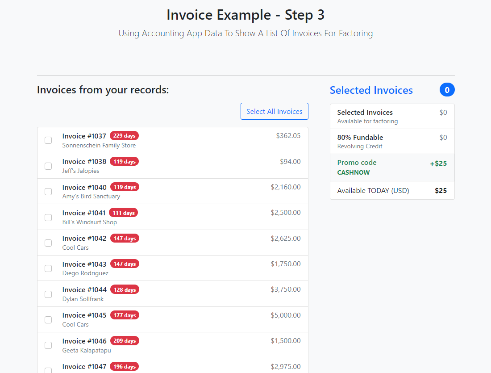
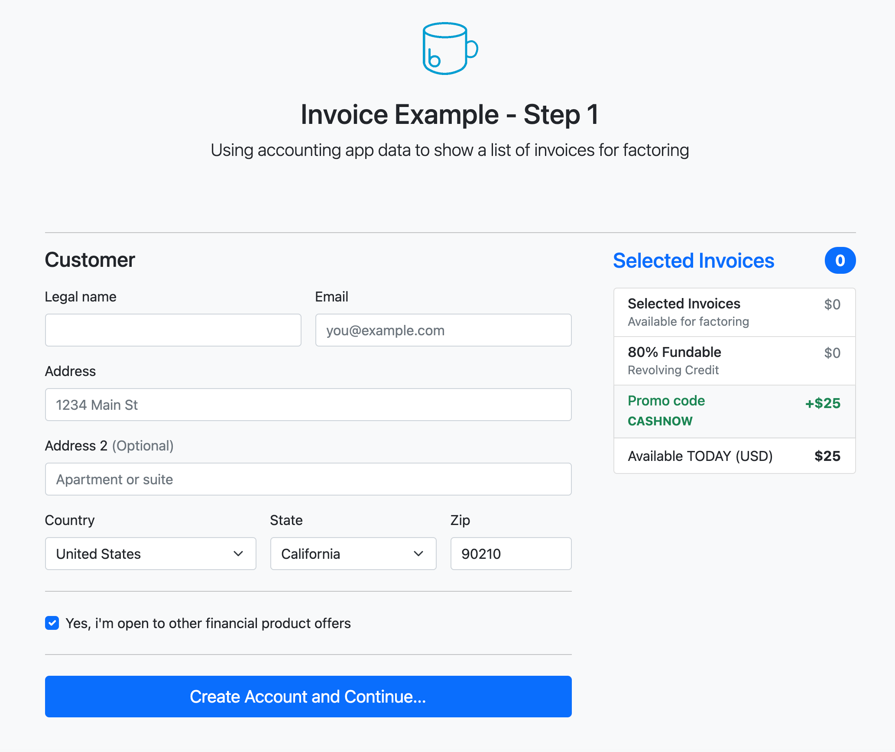

# Invoice Example

## What this app does

This is an example to demonstrate how to embed the Boss Insights javascript widget within a custom financial
application. It provides a simple workflow to gather information from a customer and connect to accounting software, gathering data
from the accounting software in order to show upcoming invoices for financing.

It does not perform any actions other than gathering invoice data from a connected customers accounting software.

> ⚠️ **Disclaimer**: This is an example application and not intended for production use as-is, it lacks code in areas such as logging and security and is provided as a bare-bones example of how to connect and fetch data from the Boss Insights API

## Steps this application performs

1. Asks customer initial questions, this step is illustrative only and no data entered is used
2. Provisions private data storage for a customer using your API credentials
3. Asks the customer to select and connect a software application
4. Authorizes access to accounting software
5. Synchronizes invoice data and presents invoices to select on screen
6. Displays a success screen, this step is illustrative only and no funding or other action occurs. It is always shows
   as successful.

## To install

The application can run on a standard Heroku dyno, or you may host it yourself. Whether you run the application yourself
or use Heroku you will need to provide environment configuration variables which are:

#### Environment Configuration Variables

| Variable           | Required | Description                                                                                                      | Example                             |
|--------------------|----------|------------------------------------------------------------------------------------------------------------------|-------------------------------------|
| ORG_NAME           | yes      | The name of your company that should be shown to users                                                           | Example Capital Corp                |
| ORG_URL            | yes      | Your Boss Insights account url                                                                                   | https://example.myintranetapps.com  |
| API_KEY            | yes      | API Key used to identify API requests for your account                                                           | APIPROJECT3                         |
| API_SECRET         | yes      | API Secret used to authenticate requests for your account                                                        |                                     |
| ADMIN_URL          | yes      | The URL to your admin app. This is region dependant and will vary depending on your data residency               | https://admin.myintranetapps.com    |
| ACCOUNT_KEY        | yes      | Your Boss Insights account unique identifier                                                                     | 5ff363e48e2a82.98390839             |
| BRAND_ACCENT_COLOR | no       | A HTML hexadecimal color code that will be used in the example app as a bold color for buttons and other accents | CA76F6                              |
| BRAND_LOGO         | no       | The URL to your company logo, will be displayed at the top of each page                                          | https://example.com/images/logo.png |

### Heroku

Preferred method: From within your Boss Insights administration console you can select the `API > Embed` menu
option, enter an API key and click the `Deploy to Heroku` button. Using this option to deploy will prefill many
of the required parameters to launch the application.

If you have manually checked out the code on GitHub and deploy to heroku manually you will need to enter Heroku config
vars (which are configured in app.json) or the application will not run without error.

[](https://www.heroku.com/deploy?template=https://github.com/boss-insights/invoice-example)

#### Viewing the application
After deploying the application can click the `view` button within Heroku to open your newly deployed app, it will be accessible at a dynamically generated domain like https://mysterious-ravine-99578.herokuapp.com/ or similar.


### Self Hosting

For testing and development purposes you can run the application from your local development machine. You will need the following installed:

* PHP 8.2 or higher - [https://www.php.net/downloads.php](https://www.php.net/downloads.php)
* Composer 2.2 or higher - [https://getcomposer.org/download/](https://getcomposer.org/download/)

It is assumed these will be added to your system [PATH](https://en.wikipedia.org/wiki/PATH_(variable)), if not you'll need to adjust the commands below to reference their full file system paths

Open a terminal and change your current working directory to the root of the freshly checked out copy of the code.
You will need to run the following commands:

#### Install library dependencies
```shell
composer update
```

#### Start a local webserver
```shell
composer start
```

This command will start a local web server running on port 8080

> ⚠️ **Note**: Composer will read a start script in the `composer.json` file in the project root folder, inside this are environment configuration variables which you will need to change to suit your account information (see the table above for a list of the variables)

#### Viewing the application
Using your web browser open [http://127.0.0.1:8080](http://127.0.0.1:8080) and you should be presented with Step 1 of the example application.

## How the example app works

When you first access the application you should be presented with `Step 1` which looks like the screenshot below:



At this point only one API call has been performed which is to add the current domain name that the app is being accessed via to an allow-list permitting embedding of the javascript widget. This is provided as an example convenience and typically in a production app you would add this manually yourself via the `Developers > Embed > Allowed URLs` menu option within the administration application. 

Clicking the `Create Account and Continue` button will use the API to provision a data storage account for a customer which will provide a unique customer account identifier that must be passed to the javascript widget on the subsequent step 2 so that it knows for which customer any connected data will be associated with.

Step 2 will present the javascript widget to allow the customer to select their preferred application to provide data (the Data Provider). See our documentation on the [embedded javascript widget](https://developers.bossinsights.com/publicdev/Embedded.889618455.html) for more details on the widget itself. Once the customer selected an application they are redirected to an authentication & authorization screen where they grant access to share data, with this completed they are redirected to the next step in our example workflow. As part of the authorization process we store a token which will allow subsequent access to the Data Provider. 

Step 3 will perform an API call using our newly granted access to the `invoices` endpoint of the Boss Insights API which will return a list of the customers invoices, these are then presented for demonstration purposes in a shopping cart style allowing the customer to select which invoices they would like to be funded, this funding selection and subsequent step 4 are illustrative and do not perform any API actions.

---

The code and above steps should give you an introduction in to how to use the Boss Insights API, For support with this example app or the API in general please use our help center at [bossinsights.com/support](https://bossinsights.com/support)

## Debugging
Two pages are made available to help troubleshoot problems:
 * [http://127.0.0.1:8080/debug.php](http://127.0.0.1:8080/debug.php) - will show all current configuration environment variables
 * [http://127.0.0.1:8080/info.php](http://127.0.0.1:8080/info.php) - will show details of the PHP webserver environment

You may be asked to provide a copy of the output of these pages if logging a support ticket regarding this sample app.
